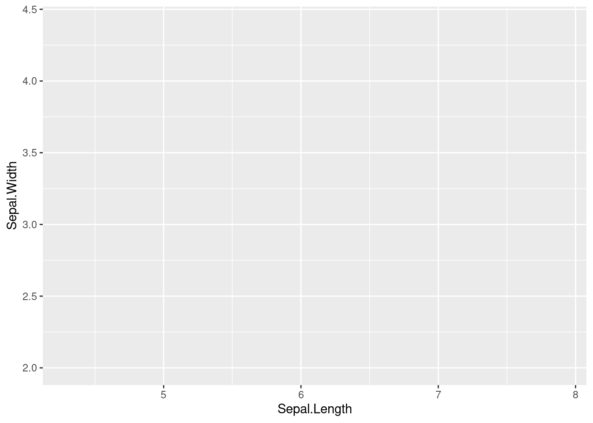
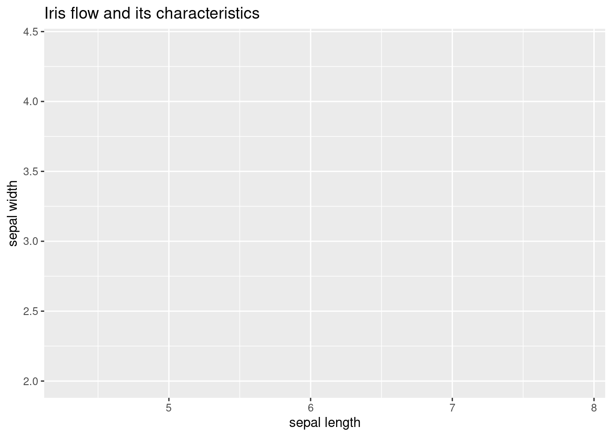
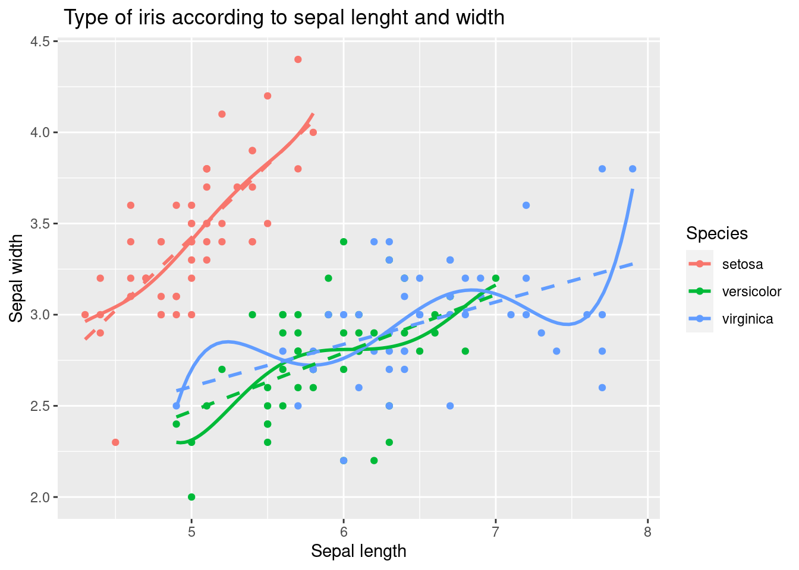

# (PART\*) Review of Data visualization {-}
# Reivew of R visualization for statistical results
## Basic plot with R


 
In this chapter, we will cover the basics of plotting with GGPLOT2, including the principles of layering and aesthetics, and some of the most common plot types. We will also introduce some related libraries. At the end of the tutorial, you will have a working visualization example for Data Explorer.

## ggplot basic

The first step in using ggplot2 is to load the library and the data you want to use. In this case, you are loading the tidyverse library, which includes ggplot2, as well as other helpful packages for data manipulation and visualization. You are also loading the iris dataset, which is a widely used dataset for demonstrating basic data visualization techniques.


```r
library(tidyverse)
data(iris)
```

The main syntax for ggplot2 includes axis and layer. Let's start from the beginning
 
### axis
 
A 2-dimensional plot requires three components of data: x-axis, y-axis, and layer. First, we draw the x-axis and y-axis, then add information using the layer component
 

```r
iris %>% # data what we used
  ggplot(aes(x = Sepal.Length, y = Sepal.Width))
```


 
 The code first loads the iris data set, which is a well-known data set in the R community that contains information about the sepal length and width of iris flowers of three different species.

Next, the code uses the ggplot function from the ggplot2 library to create a scatter plot with Sepal.Length on the x-axis and Sepal.Width on the y-axis. The aes function is used to specify the aesthetics of the plot, in this case the x and y variables. The plot will show the relationship between the sepal length and width of the iris flowers.


```r
iris %>% 
  ggplot(aes(x = Sepal.Length, y = Sepal.Width)) +
  xlab("sepal length") + ylab("sepal width") +
  ggtitle("Iris flow and its characteristics")
```


The code then adds several modifications to the plot to make it more informative and presentable. The xlab function is used to add a label to the x-axis, and the ylab function is used to add a label to the y-axis. The ggtitle function is used to add a title to the plot.

The final plot will show the relationship between sepal length and width of the iris flowers, with labeled axes and a title that provides context.


### layer, geom_x()

In ggplot2, layers are the components that you add to the plot to represent your data. The geom_ functions are used to specify the type of layer to add to the plot. For example, geom_point adds points to the plot, geom_line adds lines, geom_smooth adds a smoothing line, geom_histogram adds a histogram, geom_density adds a density plot, geom_boxplot adds a boxplot, and geom_bar adds bars.

Each geom_ function takes the aesthetics specified in the aes function as input, and maps them to the x and y variables to create the layer. You can add multiple layers to a plot to represent multiple variables or to create more complex visualizations.
 
| geom_x()| contents|
|---|---|
|geom_point()|scatter plot|
|geom_line()|line plot|
|geom_smooth()|prediction line|
|geom_histogram()|histogram|
|geom_density()|density line|
|geom_boxplot()|boxplot plot|
|geom_bar()|bar chart|

### geom_point() 

The geom_point function is used to add a layer of points to the plot, representing the individual observations in the iris data set. The geom_point function takes the aesthetics specified in the aes function and maps them to the x and y variables to create the layer of points.

```r
iris %>%
  ggplot(aes(x=Sepal.Length, y = Sepal.Width)) +
  geom_point()
```


The xlab function is used to add a label to the x-axis, and the ylab function is used to add a label to the y-axis. The ggtitle function is used to add a title to the plot. These labels and title provide context and help to interpret the plot.

The geom_point function is used to add a layer of points to the plot, representing the individual observations in the iris data set. The geom_point function takes the aesthetics specified in the aes function and maps them to the x and y variables to create the layer of points.


```r
iris %>% 
  ggplot(aes(x = Sepal.Length, y = Sepal.Width)) +
  xlab("Sepal length") + 
  ylab("Sepal width") +
  ggtitle(" Type of iris according to sepal lenght and width") +
  geom_point()
```


  
  The aes function is used to specify the aesthetics of the plot, including the x and y variables and the color variable, Species. This allows the plot to distinguish between the three different species of iris flowers in the data set and display each species with a different color.
  

```r
iris %>% 

  ggplot(aes(x = Sepal.Length, y = Sepal.Width, 
             color = Species)) + 
  xlab("Sepal length") + 
  ylab("Sepal width") +
  ggtitle(" Type of iris according to sepal lenght and width") +
  geom_point()
```


 
 
### geom_smooth() 

The geom_smooth function is used to add a layer of a smoothing line to the plot. This line provides a general representation of the relationship between the sepal length and width of the iris flowers, and helps to see any trends or patterns in the data.

The geom_point function is used to add a layer of points to the plot, representing the individual observations in the iris data set. The geom_point function takes the aesthetics specified in the aes function and maps them to the x and y variables to create the layer of points.


```r
iris %>% #
  ggplot(aes(x = Sepal.Length, y = Sepal.Width, 
             color = Species)) + 
  xlab("Sepal length") + 
  ylab("Sepal width") +
  ggtitle(" Type of iris according to sepal lenght and width") +
  geom_point() +
  geom_smooth() 
```


 The following code demonstrated example of adding a linear trend line as well as polynomial line. 


```r
iris %>%
  ggplot(aes(x = Sepal.Length, y = Sepal.Width, 
             color = Species)) + 
  xlab("Sepal length") + 
  ylab("Sepal width") +
  ggtitle(" Type of iris according to sepal lenght and width") +
  geom_point() +
  geom_smooth(method = 'lm', formula = y ~ poly(x, 5), se = FALSE, linetype = 1) + # how abou se = TRUE
  geom_smooth(method = 'lm', formula = y ~ x, se = FALSE, linetype = 2)  
```


The first geom_smooth function adds a layer of a polynomial trend line to the plot, using a 5th degree polynomial regression model specified by the formula y ~ poly(x, 5). The argument se = FALSE is used to suppress the display of confidence intervals for the trend line, and the argument linetype = 1 is used to specify the line type for the polynomial trend line.

The second geom_smooth function adds a layer of a linear trend line to the plot, using a simple linear regression model specified by the formula y ~ x. The argument se = FALSE is used to suppress the display of confidence intervals for the trend line, and the argument linetype = 2 is used to specify the line type for the linear trend line.

### faceting

This is achieved using the facet_wrap function, which allows you to display multiple panels in a single plot, each showing a different subset of the data.

In this case, the facet_wrap function is used to create panels for each species of iris, using the Species variable as the grouping variable. The formula Species~. specifies that each panel should contain a separate plot for each species, with all the other variables in the data set (represented by .) included in each plot.
The polynomial and linear trend lines are added to each panel in the same way as in the previous code. The labeled axes and title provide context and help to interpret each plot.


```r
iris %>%
  ggplot(aes(x = Sepal.Length, y = Sepal.Width, 
             color = Species)) + 
  xlab("Sepal length") + 
  ylab("Sepal width") +
  ggtitle(" Type of iris according to sepal lenght and width") +
  geom_point() +
  geom_smooth(method = 'lm', formula = y ~ poly(x, 5), se = FALSE, linetype = 1) +
  geom_smooth(method = 'lm', formula = y ~ x, se = FALSE, linetype = 2)  +
  facet_wrap(Species~.)
```


### geom_bar() 


The code creates a barplot using the iris data set. The ggplot function is used to create a basic plot with the Species variable on the x-axis. The aes function maps the Species variable to the x axis and the fill aesthetic, which controls the fill color of the bars.

The geom_bar function is used to add a layer of bars to the plot, representing the count of each species of iris in the data set. By default, geom_bar creates a barplot with bars representing the count of each unique value in the x variable.

 

```r
iris %>% 
  ggplot(aes(x = Species,  
             fill = Species)) +
  xlab("Type of iris") + 
  ylab("Counts") +
  ggtitle("Number of iris according to its types.") +
  geom_bar()
```


The code creates a barplot using the iris data set, but only for observations with Sepal.Width equal to or greater than 3. The filter function is used to select only the observations that meet the specified condition, and the rest of the code is the same as in the previous example.

The ggplot function is used to create a basic plot with the Species variable on the x-axis. The aes function maps the Species variable to the x axis and the fill aesthetic, which controls the fill color of the bars.

The geom_bar function is used to add a layer of bars to the plot, representing the count of each species of iris in the filtered data set. By default, geom_bar creates a barplot with bars representing the count of each unique value in the x variable.
 

```r
iris %>% 
  filter(Sepal.Width >3) %>% 
  ggplot(aes(x = Species,  
             fill = Species)) +
  xlab("Type of iris") + 
  ylab("Counts") +
  ggtitle("Number of iris according to its types.") +
  geom_bar()
```


The coord_polar function is used to change the coordinate system from a rectangular Cartesian system to a polar system, which is appropriate for creating pie charts. The geom_bar function is used to add a layer of bars to the plot, representing the count of each species of iris in the filtered data set. The width argument is used to set the width of the bars to 1, so that the bars represent proportions rather than counts.


```r
iris %>% 
  filter(Sepal.Width >3) %>% 
  ggplot(aes(x = Species,  
             fill = Species)) +
  xlab("Type of iris") + 
  ylab("Counts") +
  ggtitle("Number of iris according to its types.") +
  geom_bar() +
  geom_bar(width =1) + coord_polar()
```


### geom_density() , geom_histogram()

The ggplot function is used to create a basic plot with the Sepal.Length variable on the x-axis. The aes function maps the Sepal.Length variable to the x axis.

The geom_histogram function is used to add a layer of a histogram to the plot, representing the distribution of Sepal.Length. The aes function inside the geom_histogram maps the y axis to the density, which is calculated using the ..density.. expression.

The geom_density function is used to add a layer of a kernel density estimate to the plot, representing the estimated probability density function of the Sepal.Length variable.
 

```r
iris %>% 
  ggplot(aes(x = Sepal.Length)) + 
  xlab("Sepal Length of Iris") + 
  ylab("density") +
  ggtitle("Distribution of Sepal Length ") +
  geom_histogram(aes(y = ..density..))+
  geom_density()
```


The ggplot function is used to create a basic plot with the Sepal.Length variable on the x-axis. The aes function maps the Sepal.Length variable to the x axis and the Species variable to the fill color.

The geom_histogram function is used to add a layer of histograms to the plot, representing the distributions of Sepal.Length for each species of iris. The aes function inside the geom_histogram maps the y axis to the density, which is calculated using the ..density.. expression. The alpha argument is used to set the transparency of the histograms, allowing the multiple histograms to be seen together.

The geom_density function is used to add a layer of kernel density estimates to the plot, representing the estimated probability density functions of the Sepal.Length variable for each species of iris. The stat argument is set to "density" to specify that a density estimate should be plotted. The alpha argument is used to set the transparency of the density estimates, allowing the multiple density estimates to be seen together.
 


```r
iris %>% 
  ggplot(aes(x = Sepal.Length, fill = Species)) + 
  xlab("sepal length of iris") + 
  ylab("density") +
  ggtitle("Distribution of sepal length of iris") +
  geom_histogram(aes(y = ..density..), alpha = 0.3)+
  geom_density(stat="density", alpha = 0.3) +
  theme_minimal()
```


The geom_histogram function is used to add a layer of histograms to the plot, representing the distributions of Sepal.Length for each species of iris. The aes function inside the geom_histogram maps the y axis to the density, which is calculated using the ..density.. expression. The alpha argument is used to set the transparency of the histograms, allowing the multiple histograms to be seen together.

The geom_density function is used to add a layer of kernel density estimates to the plot, representing the estimated probability density functions of the Sepal.Length variable for each species of iris. The stat argument is set to "density" to specify that a density estimate should be plotted. The alpha argument is used to set the transparency of the density estimates, allowing the multiple density estimates to be seen together.

The facet_wrap function is used to create panels of the plot, separated by species. The argument Species~. specifies that the panels should be created for each species, and the . symbol indicates that there is no faceting on the y axis.


```r
iris %>% 
  ggplot(aes(x = Sepal.Length, fill = Species)) + 
  xlab("sepal length of iris") + 
  ylab("density") +
  ggtitle("Distribution of sepal length of iris") +
  geom_histogram(aes(y = ..density..), alpha = 0.3)+
  geom_density(stat="density", alpha = 0.3) +
  theme_minimal() + # my favorit theme
  facet_wrap(Species~.)
```


### geom_boxplot()

The geom_boxplot function is used to add a layer of boxplots to the plot, representing the distributions of Sepal.Width for each species of iris. The boxplot shows the median, quartiles, and outliers of the data, allowing for a quick visualization of the central tendency and spread of the data.
 

```r
iris %>% 
  ggplot(aes(x = Species, y = Sepal.Width, 
             color = Species)) +
  geom_boxplot()
```


### 3d plot

The code creates a 3D scatter plot using the plot_ly function from the plotly library. The plot_ly function creates a basic plot with the Sepal.Length variable on the x-axis, the Petal.Length variable on the y-axis, and the Petal.Width variable on the z-axis.

The color argument inside the plot_ly function maps the Species variable to the color of the markers, so that each species of iris is plotted with a different color.

The type argument is set to "scatter3d", which specifies that the plot should be a 3D scatter plot. The alpha argument sets the opacity of the markers, making them semi-transparent so that overlapping markers can be seen.

The layout function is used to add a title to each axis, using the xaxis, yaxis, and zaxis arguments. The title argument inside each axis specifies the title of the corresponding axis.


```r
library(plotly)
iris %>%
plot_ly( 
        x = ~Sepal.Length, y = ~Petal.Length, z = ~Petal.Width,  
        color = ~Species,  # Color separation by Species. 
        type = "scatter3d",   # 3d plot
        alpha = 0.8
        ) %>%  
        layout(
               scene = list(xaxis = list(title = 'Sepal Length'), 
                            yaxis = list(title = 'Petal Length'),
                            zaxis = list(title = 'Petal Width')))
```

```{=html}
<div class="plotly html-widget html-fill-item-overflow-hidden html-fill-item" id="htmlwidget-cb3e98d3cf33e26e5acc" style="width:672px;height:480px;"></div>
<script type="application/json" data-for="htmlwidget-cb3e98d3cf33e26e5acc">{"x":{"visdat":{"17c1db7eae014b":["function () ","plotlyVisDat"]},"cur_data":"17c1db7eae014b","attrs":{"17c1db7eae014b":{"x":{},"y":{},"z":{},"color":{},"alpha":0.8,"alpha_stroke":1,"sizes":[10,100],"spans":[1,20],"type":"scatter3d"}},"layout":{"margin":{"b":40,"l":60,"t":25,"r":10},"scene":{"xaxis":{"title":"Sepal Length"},"yaxis":{"title":"Petal Length"},"zaxis":{"title":"Petal Width"}},"hovermode":"closest","showlegend":true},"source":"A","config":{"modeBarButtonsToAdd":["hoverclosest","hovercompare"],"showSendToCloud":false},"data":[{"x":[5.1,4.9,4.7,4.6,5,5.4,4.6,5,4.4,4.9,5.4,4.8,4.8,4.3,5.8,5.7,5.4,5.1,5.7,5.1,5.4,5.1,4.6,5.1,4.8,5,5,5.2,5.2,4.7,4.8,5.4,5.2,5.5,4.9,5,5.5,4.9,4.4,5.1,5,4.5,4.4,5,5.1,4.8,5.1,4.6,5.3,5],"y":[1.4,1.4,1.3,1.5,1.4,1.7,1.4,1.5,1.4,1.5,1.5,1.6,1.4,1.1,1.2,1.5,1.3,1.4,1.7,1.5,1.7,1.5,1,1.7,1.9,1.6,1.6,1.5,1.4,1.6,1.6,1.5,1.5,1.4,1.5,1.2,1.3,1.4,1.3,1.5,1.3,1.3,1.3,1.6,1.9,1.4,1.6,1.4,1.5,1.4],"z":[0.2,0.2,0.2,0.2,0.2,0.4,0.3,0.2,0.2,0.1,0.2,0.2,0.1,0.1,0.2,0.4,0.4,0.3,0.3,0.3,0.2,0.4,0.2,0.5,0.2,0.2,0.4,0.2,0.2,0.2,0.2,0.4,0.1,0.2,0.2,0.2,0.2,0.1,0.2,0.2,0.3,0.3,0.2,0.6,0.4,0.3,0.2,0.2,0.2,0.2],"type":"scatter3d","mode":"markers","name":"setosa","marker":{"color":"rgba(102,194,165,0.8)","line":{"color":"rgba(102,194,165,1)"}},"textfont":{"color":"rgba(102,194,165,0.8)"},"error_y":{"color":"rgba(102,194,165,0.8)"},"error_x":{"color":"rgba(102,194,165,0.8)"},"line":{"color":"rgba(102,194,165,0.8)"},"frame":null},{"x":[7,6.4,6.9,5.5,6.5,5.7,6.3,4.9,6.6,5.2,5,5.9,6,6.1,5.6,6.7,5.6,5.8,6.2,5.6,5.9,6.1,6.3,6.1,6.4,6.6,6.8,6.7,6,5.7,5.5,5.5,5.8,6,5.4,6,6.7,6.3,5.6,5.5,5.5,6.1,5.8,5,5.6,5.7,5.7,6.2,5.1,5.7],"y":[4.7,4.5,4.9,4,4.6,4.5,4.7,3.3,4.6,3.9,3.5,4.2,4,4.7,3.6,4.4,4.5,4.1,4.5,3.9,4.8,4,4.9,4.7,4.3,4.4,4.8,5,4.5,3.5,3.8,3.7,3.9,5.1,4.5,4.5,4.7,4.4,4.1,4,4.4,4.6,4,3.3,4.2,4.2,4.2,4.3,3,4.1],"z":[1.4,1.5,1.5,1.3,1.5,1.3,1.6,1,1.3,1.4,1,1.5,1,1.4,1.3,1.4,1.5,1,1.5,1.1,1.8,1.3,1.5,1.2,1.3,1.4,1.4,1.7,1.5,1,1.1,1,1.2,1.6,1.5,1.6,1.5,1.3,1.3,1.3,1.2,1.4,1.2,1,1.3,1.2,1.3,1.3,1.1,1.3],"type":"scatter3d","mode":"markers","name":"versicolor","marker":{"color":"rgba(252,141,98,0.8)","line":{"color":"rgba(252,141,98,1)"}},"textfont":{"color":"rgba(252,141,98,0.8)"},"error_y":{"color":"rgba(252,141,98,0.8)"},"error_x":{"color":"rgba(252,141,98,0.8)"},"line":{"color":"rgba(252,141,98,0.8)"},"frame":null},{"x":[6.3,5.8,7.1,6.3,6.5,7.6,4.9,7.3,6.7,7.2,6.5,6.4,6.8,5.7,5.8,6.4,6.5,7.7,7.7,6,6.9,5.6,7.7,6.3,6.7,7.2,6.2,6.1,6.4,7.2,7.4,7.9,6.4,6.3,6.1,7.7,6.3,6.4,6,6.9,6.7,6.9,5.8,6.8,6.7,6.7,6.3,6.5,6.2,5.9],"y":[6,5.1,5.9,5.6,5.8,6.6,4.5,6.3,5.8,6.1,5.1,5.3,5.5,5,5.1,5.3,5.5,6.7,6.9,5,5.7,4.9,6.7,4.9,5.7,6,4.8,4.9,5.6,5.8,6.1,6.4,5.6,5.1,5.6,6.1,5.6,5.5,4.8,5.4,5.6,5.1,5.1,5.9,5.7,5.2,5,5.2,5.4,5.1],"z":[2.5,1.9,2.1,1.8,2.2,2.1,1.7,1.8,1.8,2.5,2,1.9,2.1,2,2.4,2.3,1.8,2.2,2.3,1.5,2.3,2,2,1.8,2.1,1.8,1.8,1.8,2.1,1.6,1.9,2,2.2,1.5,1.4,2.3,2.4,1.8,1.8,2.1,2.4,2.3,1.9,2.3,2.5,2.3,1.9,2,2.3,1.8],"type":"scatter3d","mode":"markers","name":"virginica","marker":{"color":"rgba(141,160,203,0.8)","line":{"color":"rgba(141,160,203,1)"}},"textfont":{"color":"rgba(141,160,203,0.8)"},"error_y":{"color":"rgba(141,160,203,0.8)"},"error_x":{"color":"rgba(141,160,203,0.8)"},"line":{"color":"rgba(141,160,203,0.8)"},"frame":null}],"highlight":{"on":"plotly_click","persistent":false,"dynamic":false,"selectize":false,"opacityDim":0.2,"selected":{"opacity":1},"debounce":0},"shinyEvents":["plotly_hover","plotly_click","plotly_selected","plotly_relayout","plotly_brushed","plotly_brushing","plotly_clickannotation","plotly_doubleclick","plotly_deselect","plotly_afterplot","plotly_sunburstclick"],"base_url":"https://plot.ly"},"evals":[],"jsHooks":[]}</script>
```


